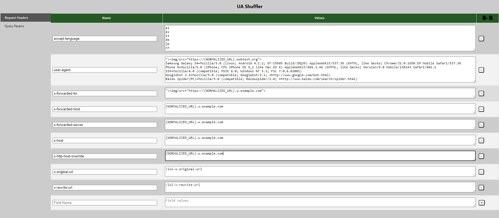
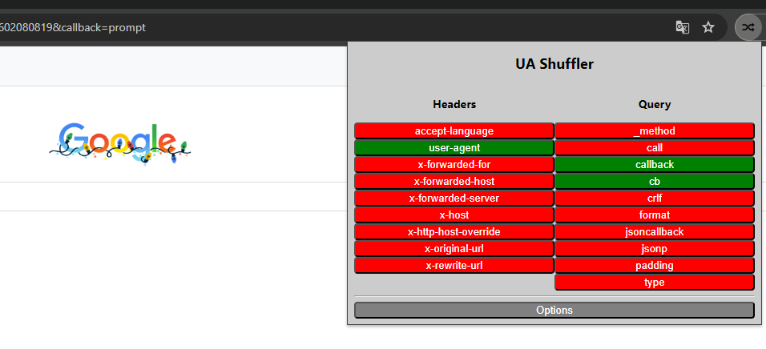

## ua-shuffler

ua-shuffler is a chrome extension that lets you specify request headers with a list of values that are then randomly "shuffled" trough on every request.

+interpolation support for vars {BASE32_URL_PREFIX}, {UNIXTIME}, {DOCUMENT_URL}, {ORIGIN_URL} & {INITIATOR_URL}

+support for cache buster insertion on every request

### Installation Instructions
- Clone Repo or Download Zip 
- Visit chrome://extensions/ and turn on "Developer mode"
- Click "Load unpacked" button and navivigate to the folder containing the manifest.json file